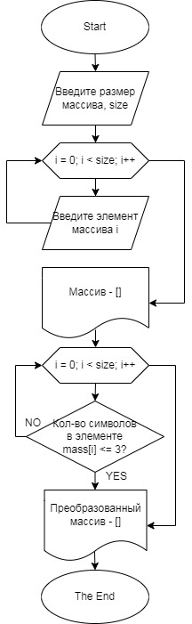

*Для решения Итоговой проверочной работы необходимо:*
1. Создать репозиторий на GitHub;
2. Нарисовать блок-схему алгоритма;
3. Снабдить репозиторий оформленным текстовым описанием решения;
4. Написать программу на C#;
5. Использователь Git.

**Задача:** Написать программу, которая из имеющегося массива строк формирует массив из строк, длина которых меньше либо равна 3 символа.

Решение:
1. [Репозиторий](https://github.com/Daryashasm/FinalControlWork);
2. Блок-схема располагаетася в папке №2, файл - diagram.jpg, но для наглядности, вот:

3. Это файл, который Вы сейчас читаете :).
4. Код написан, лежит в папке №1, файл - program.cs.
5. Git использовался на протяжение всей работы.

А теперь описания решения.
Сначала пользователь указывает **размер массива**, ввести можно только целочисленное число.

Далее создается массив строк, размер которого был задан пользователем.

Запускается цикл, в котором Пользователь поочередно вводит с клавиатуры элементы массива. Формируется и выводится на экран *Исходный массив*.

Далее запускается цикл, в котором проверяется количество символов у **каждого элемента** *Исходного массива*. Если количество символов меньше либо равно 3 то, данный элемент запоминается и выводится в *Преобразованный массив*, иначе данный элемент игнорируется и проверяется следующий.

После завршения цикла на экран выводится *Преобразованный массив*, который состоит только из элементов, у которых количество символов меньше либо равно 3.

